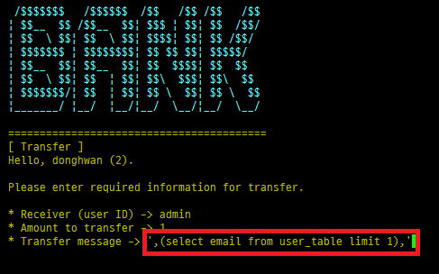
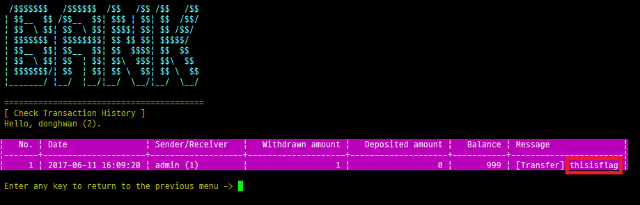

# Service 1. Bank

Service 1은 은행 업무 서비스를 제공하고 있다. 은행 서비스 중 본인 계좌의 금액을 송금하는 transfer 기능에서 SQL Injection이 가능하였고, 이를 이용하여 DB에 저장된 flag의 값을 조회하는 SQL 쿼리를 삽입할 수 있었다. 삽입된 쿼리는 transaction history 기능에서 지난 송금 기록을 조회할 때 실행되어 flag 값을 사용자에게 노출하게 된다.  

```python
def store_transaction(self, user_id, user_acc, receiver_id, receiver_acc, amount, msg):
    .......							                 
    sql = "INSERT INTO `tran_table` " \	
          "(`from_account`, `to_account`, `remit`, `msg`, " \
          " `from_balance`, `to_balance`) " \
          "VALUES(%s, %s, %s, concat ('[Transfer] ', '%s'), %s, %s)"

	if not self.update_balance(user_id, -amount):
        raise
    if not self.update_balance(receiver_id, amount):
        raise

    # AFTER update_balance
    from_bal = self.get_balance(user_id)
    to_bal = self.get_balance(receiver_id)

	cursor.execute(sql % (user_acc, receiver_acc, amount, msg, from_bal, to_bal))
    conn.commit()
```
위의 코드는 금액을 송금할 때 실행되는 SQL 쿼리이다. 그중 msg 값은 사용자가 임의로 입력할 수 있는 문자열 내용이며, 쿼리 실행시 이 값에 대한 올바른 검증이 이루어지지 않는다. 이러한 취약점을 이용하여 아래와 같은 SQL Injection 공격 구문 삽입이 가능하다. 공격 구문은 아래 림과 같이 SQL 쿼리에서 사용하고 있던 concat 함수를 활용하는 구문을 사용하였다.



Transfer 기능에서 입력된 SQL Injection 구문은 Check transaction history 페이지에서 확인 가능하다. Message 구문을 출력하려고 할 때, 삽입된 구문에 의해서 DB에 저장된 flag 값(user\_table에 있는 admin의 eamil 값)을 가져올 수 있다. 
*첨부된 그림 파일들은 write-up을 위해 재현된 내용으로 Flag 값에 "thisisflag"란 값을 입력한 후 진행되었다.


