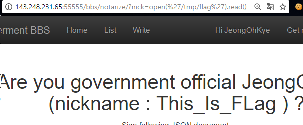

# Service 5. Government

Service5는 게시판서비스를 제공하고 있는데 유저 권한이 일반 유저와 Notarized 유저 2개로 구분이 된다. Notarize를 받기 위한 부분의 코드를 보면 nick이라는 값을 받고, 이 값을 eval하는 것을 확인 할 수 있다.

```python
def notarize(request):
    if request.method == 'GET':
        nick = request.GET.get('nick')
        if nick is None:
            nick = ''
        filtering = ['import', 'exec', 'eval', 'pickle', 'os', 'subprocess', 'sys', 'input']
        for f in filtering:
            if f in nick:
                nick = ''
                break
        if nick != '':
            nick = eval(nick)
        return render(request, 'bbs/notarize.html', {'nick' : nick})
```
위의 코드에서 볼 수 있듯이, 간단한 filtering을 통과하면 바로 eval을 통해서 임의의 python 코드를 실행시키게 된다. import나 os등이 막혀있기는 하지만, 우리의 목적은 flag파일을 읽는 것이기 때문에 open과 read함수를 통해서 파일을 열어서 키를 확인 할 수 있게 된다.




위의 그림처럼 임의의 파일을 열어 내용을 확인 할 수 있으모로, flag파일의 값을 읽어 키를 획득하였다.


